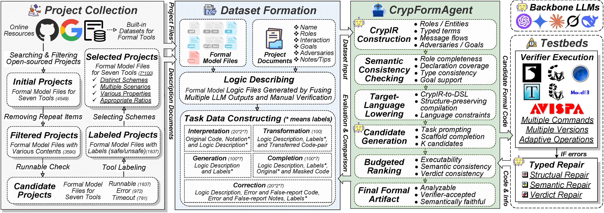
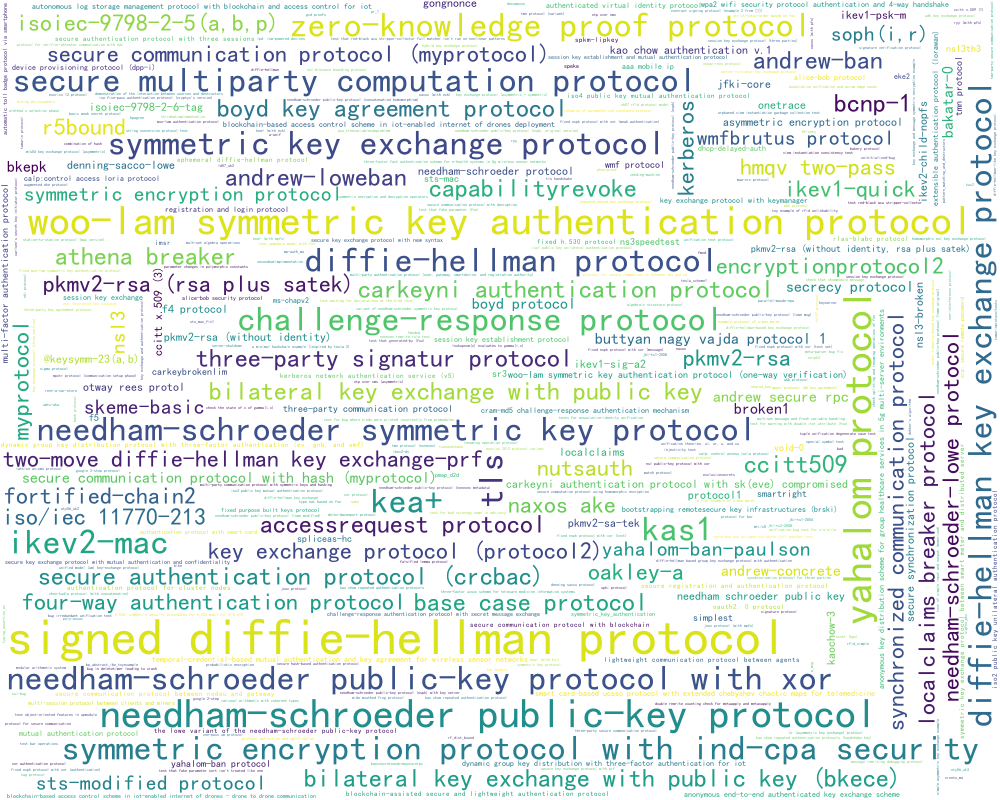
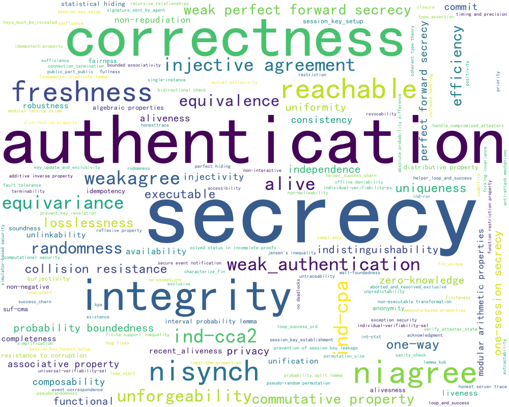

<h1 align="center">🚀 CrypFormAgent</h1>

<p align="center">
  <b>Semantics-Constrained and Verifier-Guided Formalization for Cryptographic Scheme Analysis</b>
</p>

<p align="center">
  <a href="https://Eval4LLMs.github.io/CrypFormAgent"></a>
  <a href="code/"></a>
  <a href="datasets/"></a>
  <a href="scoring/"></a>
  <a href="#-references"></a>
</p>

<p align="center">
  
</p>

> **Goal.** CrypFormAgent turns one-shot LLM formalization into controlled synthesis: build a shared semantic representation, lower it into verifier languages, repair with verifier feedback, and rank candidates under fixed budgets.

---

## 🌐 View the interactive artifact page at [`https://Eval4LLMs.github.io/CrypFormAgent`](https://Eval4LLMs.github.io/CrypFormAgent).

## 🔗 Quick Links

Start here if you already know what you want to inspect.

| I want to... | Open |
| --- | --- |
| browse the headline findings and leaderboard | [`#-result-snapshot`](#-result-snapshot) |
| inspect aggregate counters and released model outputs | [`results/`](results/) |
| run the executable artifact-facing implementation | [`code/`](code/) |
| review dataset construction, coverage, and taxonomy | [`datasets/`](datasets/) |
| open the dashboard trace files directly | [`html/`](html/) |
| check metric sensitivity and interpretation audits | [`scoring/`](scoring/) |
| understand the framework architecture | [`implementation/`](implementation/) |
| inspect deterministic lowering examples | [`lowering/`](lowering/) |

---

## 📌 At a Glance

| Dimension | Value |
| --- | ---: |
| Formal instances | 700 |
| Distinct schemes | 677 |
| Formal languages/tools | 7 |
| Deduplicated security properties | 160 |
| Task interfaces | 5 |
| Released backbone output families | 7 |

**Languages/tools.** SPDL/Scyther, SPTHY/Tamarin, PV/ProVerif, HLPSL/AVISPA, Maude/Maude-NPA, EC/EasyCrypt, and CV/CryptoVerif.

**Tasks.** Generation, completion, correction, interpretation, and cross-language transformation.

---

## 🗂️ Dataset Snapshot

The evaluation suite is designed to cover the full lifecycle of cryptographic scheme formalization, from informal intent and partial code to verifier-facing artifacts and cross-language translations.

<p align="center">
  
  
  <br>
  <sub><b>Left:</b> protocol/scheme coverage. <b>Right:</b> normalized security-property coverage.</sub>
</p>

| Task | Input | Output | Evaluation signal |
| --- | --- | --- | --- |
| Generation | Logic description | Complete formal artifact | Analyzability and verdict correctness |
| Completion | Masked formal code | Completed formal artifact | Analyzability and verdict correctness |
| Correction | Faulty formal code | Repaired formal artifact | Error recovery or false-verdict repair |
| Interpretation | Formal artifact | Notation/logic explanation | Semantic similarity and verifier compatibility |
| Transformation | Source formal language | Target formal language | Target verifier result and verdict preservation |

For the full taxonomy of 160 normalized property labels and per-language coverage figures, see [`datasets/`](datasets/).

---

## 🧠 Why CrypFormAgent?

Cryptographic scheme formalization is not ordinary code generation. A useful formal artifact must be accepted by a downstream verifier, preserve the intended roles and message flow, encode the correct security goals, and agree with the expected scheme-level verdict. Direct LLM outputs often look formal while still failing one of these verifier-facing requirements.

CrypFormAgent addresses this gap by adding semantic control and verifier feedback around the model:

```text
scheme/task input
      |
      v
CrypIR: roles, typed terms, messages, attacker assumptions, goals
      |
      v
semantic consistency checks -> deterministic target-language lowering
      |
      v
LLM candidate generation -> verifier execution -> typed repair
      |
      v
budgeted ranking and final artifact selection
```

---

## ✨ Contributions

| Contribution | Summary |
| --- | --- |
| Problem characterization | Cryptographic formalization is framed as verifier-grounded semantic construction, not text-only generation. |
| Framework | CrypFormAgent combines CrypIR, semantic consistency checks, deterministic lowering, typed repair, and budgeted ranking. |
| Evaluation suite | Five task families across seven verifier languages and 160 normalized security-property labels. |
| Empirical finding | The framework consistently improves verifier-facing construction tasks, especially generation and transformation. |

---

## 🏆 Result Snapshot

The direct-baseline study shows that LLMs are stronger on interpretation and local completion, but remain unreliable for end-to-end generation and cross-language transformation. Scores below are the dashboard capability scores in `[0, 100]`; full counters and released outputs are under [`results/`](results/).

### Overall Leaderboard

| Rank | System | Group | Overall | Progress |
| ---: | --- | --- | ---: | --- |
| 🥇 1 | **C.F.A-GPT-5.5** | CrypFormAgent | **77.9** | ████████████████░░░░ |
| 🥈 2 | **C.F.A-GPT-5.4** | CrypFormAgent | **74.8** | ███████████████░░░░░ |
| 🥉 3 | **C.F.A-DeepSeek-V4-Pro** | CrypFormAgent | **69.1** | ██████████████░░░░░░ |
| 4 | GPT-5.5 | Direct | 60.9 | ████████████░░░░░░░░ |
| 5 | GPT-5.4 | Direct | 55.0 | ███████████░░░░░░░░░ |
| 6 | Claude-3.5-Sonnet-Coder | Direct | 48.7 | ██████████░░░░░░░░░░ |
| 7 | DeepSeek-V4-Pro | Direct | 47.6 | ██████████░░░░░░░░░░ |
| 8 | GPT-5.1 | Direct | 39.2 | ████████░░░░░░░░░░░░ |
| 9 | DeepSeek-Coder | Direct | 38.6 | ████████░░░░░░░░░░░░ |
| 10 | GPT-4o | Direct | 35.0 | ███████░░░░░░░░░░░░░ |
| 11 | DeepSeek-R1 | Direct | 34.6 | ███████░░░░░░░░░░░░░ |
| 12 | LLaMA4-Instruct | Direct | 27.8 | ██████░░░░░░░░░░░░░░ |
| 13 | GPT-4o-mini | Direct | 23.0 | █████░░░░░░░░░░░░░░░ |
| 14 | Gemini-2.5-Pro | Direct | 22.8 | █████░░░░░░░░░░░░░░░ |
| 15 | Grok-3 | Direct | 18.0 | ████░░░░░░░░░░░░░░░░ |
| 16 | GLM-4 | Direct | 16.1 | ███░░░░░░░░░░░░░░░░░ |

### Capability Snapshot

| Task | Best CrypFormAgent | Score | Best direct baseline | Score | Takeaway |
| --- | --- | ---: | --- | ---: | --- |
| Generation | C.F.A-GPT-5.5 | 81.4 | GPT-5.5 | 57.4 | Semantic scaffolding most visibly helps end-to-end construction. |
| Completion | C.F.A-GPT-5.5 | 94.3 | GPT-5.1 | 76.0 | Local completion is easier, but verifier guidance still raises reliability. |
| Correction | C.F.A-GPT-5.5 | 83.4 | GPT-5.4 | 76.7 | Typed repair improves both syntax-error and false-verdict cases. |
| Transformation | C.F.A-GPT-5.5 | 48.1 | GPT-5.5 | 36.7 | Cross-language translation remains hard and benefits from CrypIR. |
| Interpretation | C.F.A-GPT-5.5 | 94.1 | GPT-4o | 94.1 | Direct LLMs are already strong on explanation-style tasks. |

### Backbone Improvements

| Backbone | Direct overall | CrypFormAgent overall | Absolute gain |
| --- | ---: | ---: | ---: |
| DeepSeek-V4-Pro | 47.6 | 69.1 | +21.5 |
| GPT-5.4 | 55.0 | 74.8 | +19.8 |
| GPT-5.5 | 60.9 | 77.9 | +17.0 |

The largest gains appear on verifier-facing construction tasks, where formal outputs must be analyzable and verdict-consistent rather than merely plausible.

### Ablation Snapshot

| System variant | Overall | Generation | Correction | Transformation | Interpretation |
| --- | ---: | ---: | ---: | ---: | ---: |
| Full C.F.A-GPT-5.5 | 77.86 | 81.35 | 83.40 | 48.14 | 94.14 |
| w/o LLM-assisted review | 74.30 | 75.53 | 77.29 | 47.55 | 90.65 |
| w/o budgeted ranking | 73.11 | 72.28 | 79.36 | 47.28 | 90.78 |
| w/o typed repair | 72.32 | 73.02 | 77.87 | 45.96 | 88.52 |
| w/o semantic consistency checking | 67.10 | 60.64 | 81.37 | 43.59 | 84.29 |
| w/o CrypIR | 66.47 | 60.25 | 83.02 | 42.96 | 85.24 |
| w/o deterministic lowering | 58.63 | 66.39 | 79.83 | 0.00 | 87.02 |

### Budget and Verifier-Feedback Study

| Setting | Overall | Generation | Correction | Transformation | Timeout |
| --- | ---: | ---: | ---: | ---: | ---: |
| Direct@1 | 47.59 | 21.63 | 73.58 | 14.90 | 8.0% |
| Pass@K | 57.28 | 45.53 | 76.77 | 35.47 | 3.0% |
| Verifier-Rerank@K | 62.95 | 50.65 | 83.25 | 39.45 | 2.0% |
| Verifier-Feedback Repair@K | 63.37 | 54.61 | 79.72 | 42.33 | 2.0% |
| Verifier-Repair + Ranking | 65.39 | 51.29 | 87.10 | 36.09 | 3.0% |
| Full CrypFormAgent | 69.14 | 67.47 | 79.71 | 42.27 | 2.0% |

### Transformation Counters

The aggregate result file also exposes task-level counters. The table below shows the released transformation slice for three backbones, using `num_analysis / len` as the analyzability count and `num_timeout` as the timeout count.

| System | Generated | Analyzable | Timeout |
| --- | ---: | ---: | ---: |
| DeepSeek-V4-Pro direct | 72 / 100 | 19 / 100 | 8 |
| C.F.A-DeepSeek-V4-Pro | 91 / 100 | 42 / 100 | 2 |
| GPT-5.4 direct | 58 / 100 | 30 / 100 | 4 |
| C.F.A-GPT-5.4 | 99 / 100 | 46 / 100 | 2 |
| GPT-5.5 direct | 73 / 100 | 36 / 100 | 3 |
| C.F.A-GPT-5.5 | 100 / 100 | 48 / 100 | 2 |

### Released Trace Coverage

The static dashboard is convenient, but the underlying trace files are also available directly:

| Dashboard view | Trace file |
| --- | --- |
| Generation | [`html/generation.json`](html/generation.json) |
| Completion | [`html/completion.json`](html/completion.json) |
| Transformation | [`html/translation.json`](html/translation.json) |
| Interpretation, logic-level | [`html/interpretation_logic.json`](html/interpretation_logic.json) |
| Interpretation, notation-level | [`html/interpretation_notation.json`](html/interpretation_notation.json) |
| Correction, false-verdict repair | [`html/correction_false.json`](html/correction_false.json) |
| Correction, syntax/error repair | [`html/correction_error.json`](html/correction_error.json) |

For full aggregate counters and released model-output bundles, see [`results/`](results/). For scoring sensitivity and interpretation-similarity validation, see [`scoring/`](scoring/).

---

## 🧭 Experiment Index

The main README should stay compact, so this page lists headline experiments and points to the detailed evidence files.

| Experiment | What it answers | Where to inspect |
| --- | --- | --- |
| Direct LLM diagnostic baseline | Are raw LLMs enough for verifier-facing formalization? | [`results/model_language_task_results.json`](results/model_language_task_results.json), [`html/`](html/) |
| Full CrypFormAgent comparison | How much does semantic control and verifier feedback improve backbone models? | [`results/`](results/) |
| Component ablation | Which framework components matter? | [`results/model_language_task_results.json`](results/model_language_task_results.json) |
| Metric sensitivity | Are model rankings stable under alternative scoring weights? | [`scoring/`](scoring/) |
| Interpretation similarity validation | Does embedding similarity align with human inspection? | [`scoring/`](scoring/) |
| Transformation construction | Which protocol clusters support cross-language translation? | [`datasets/transformation/`](datasets/transformation/) |
| Reference implementation smoke tests | Can artifact readers run the public interfaces locally? | [`code/`](code/) |

Additional experiments are worth including when they support a paper claim, explain a robustness concern, or help artifact reviewers reproduce a result. For readability, keep one-line summaries here and place full tables, traces, or case studies in the relevant subfolder README.

---

## 🗂️ Repository Map

The map below describes the artifact layout. Use it as the structural index after the task-oriented links above.

| Path | Description |
| --- | --- |
| [`index.html`](index.html) | Static dashboard and task-trace viewer. |
| [`datasets/`](datasets/) | Evaluation-suite summaries, coverage figures, task data, and property taxonomy. |
| [`datasets/generation/`](datasets/generation/) | Generation task records by verifier language. |
| [`datasets/completion/`](datasets/completion/) | Masked-code completion records. |
| [`datasets/correction/`](datasets/correction/) | Syntax-error and false-verdict repair records. |
| [`datasets/interpretation/`](datasets/interpretation/) | Logic-level and notation-level interpretation records. |
| [`datasets/transformation/`](datasets/transformation/) | Cross-language transformation task specification and data. |
| [`html/`](html/) | JSON trace pack consumed by the dashboard viewer. |
| [`results/`](results/) | Aggregated result data and released model outputs. |
| [`code/`](code/) | Executable offline reference implementation for the public interfaces. |
| [`code/crypformagent/`](code/crypformagent/) | Python package exposing the CLI and pipeline interfaces. |
| [`code/tests/`](code/tests/) | Smoke tests for the offline harness. |
| [`implementation/`](implementation/) | Architecture-level notes for the research system. |
| [`lowering/`](lowering/) | Examples of deterministic target-language lowering. |
| [`scoring/`](scoring/) | Metric sensitivity checks and interpretation-similarity audit examples. |

---

## 🖥️ Run the Dashboard Locally

The dashboard loads JSON files via relative HTTP requests, so serve the repository root instead of opening `index.html` directly:

```bash
python3 -m http.server 8000
```

Then open:

```text
http://localhost:8000/index.html
```

---

## 🧪 Implementation

The [`code/`](code/) directory contains a deterministic offline harness for the stable interfaces used by the paper:

| Interface | Role |
| --- | --- |
| `CrypIR` | Tool-neutral semantic object. |
| `Lowerer.lower(...)` | CrypIR-to-target-language scaffold projection. |
| `LLMProvider.generate(...)` | Replaceable candidate-generation provider. |
| `VerifierAdapter.verify(...)` | Normalized verifier result contract. |
| `Repairer.repair(...)` | Typed verifier-feedback repair hook. |
| `Ranker.rank(...)` | Candidate selection contract. |

Smoke run:

```bash
cd CrypFormAgent/code
python3 -m crypformagent run \
  --input examples/minimal_generation.json \
  --target spdl \
  --output artifacts/smoke_spdl.json
```

Bounded batch run over released records:

```bash
python3 -m crypformagent batch \
  --input ../datasets/generation/spdl_datasets_data_eng_100.json \
  --target spdl \
  --limit 5
```

---

## 📦 Data Availability

This public artifact includes the dashboard data, released task traces, figures, aggregate results, and an executable reference implementation of the artifact-facing interfaces. The offline code harness is designed for inspection and smoke testing; the quantitative results reported in the paper are backed by the released traces and result files under [`html/`](html/) and [`results/`](results/).

## 📚 References

- **ProVerif** — Bruno Blanchet. *Automatic Verification of Security Protocols with Secrecy and Authentication.* (Foundational docs and subsequent manuals).
- **Tamarin Prover** — Benedikt Schmidt, Santiago G. Álvarez, David Basin et al. *Automated Verification of Security Protocols with Tamarin.*
- **Scyther** — Cas Cremers. *Scyther: Semantics and Verification of Security Protocols.*
- **AVISPA** — Alessandro Armando et al. *The AVISPA Tool for the Automated Validation of Internet Security Protocols and Applications.*
- **Maude-NPA** — Santiago Escobar, Catherine Meadows, José Meseguer et al. *Maude-NPA: Cryptographic Protocol Analysis Modulo Equational Properties.*
- **CryptoVerif** — Bruno Blanchet. *A Computationally Sound Mechanized Prover for Security Protocols.*
- **EasyCrypt** — Gilles Barthe, Benjamin Grégoire, Sylvain Heraud, Santiago Zanella-Béguelin et al. *Computer-Aided Security Proofs for Cryptographic Programs.*
- **Symbolic vs. Computational** — Ran Canetti; Shoup; Bellare & Rogaway. Canonical works on UC, IND-CPA/CCA, and reductionist proofs.
- **Program Repair/Tool-in-the-Loop** — Works on syntax- and feedback-guided repair that inspire our “fix” tasks and verifier-feedback loops.
