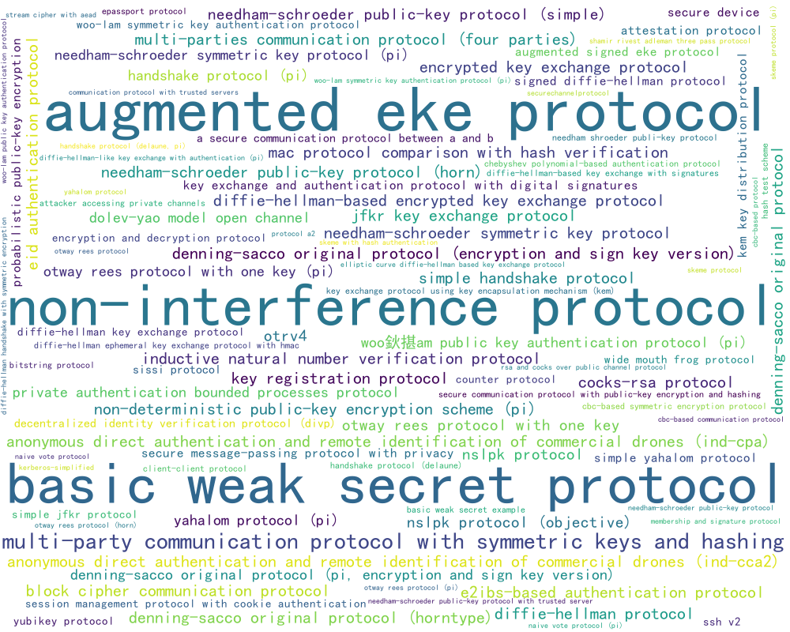
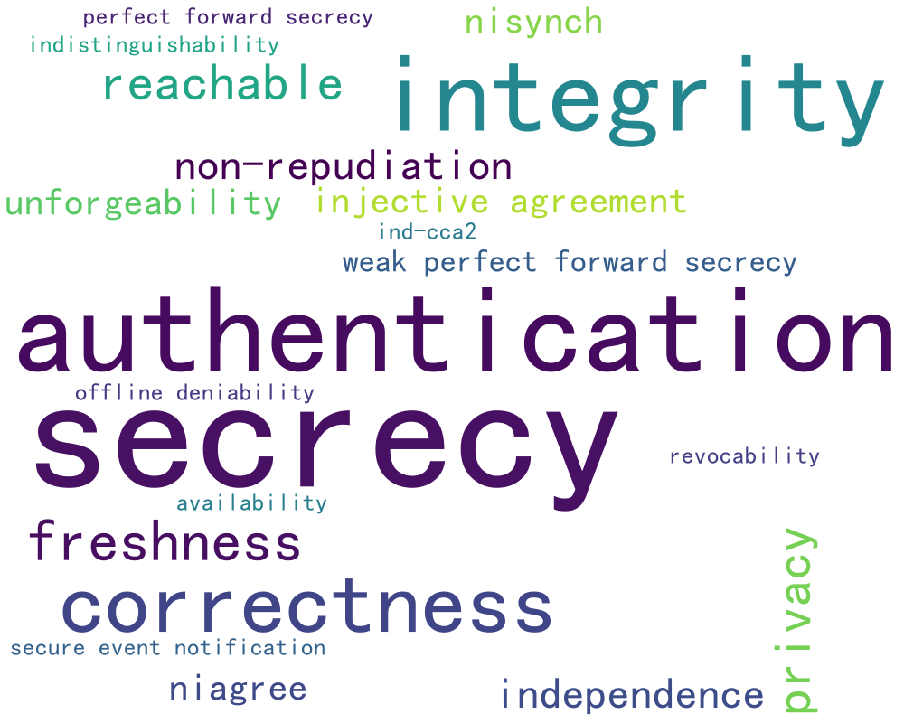
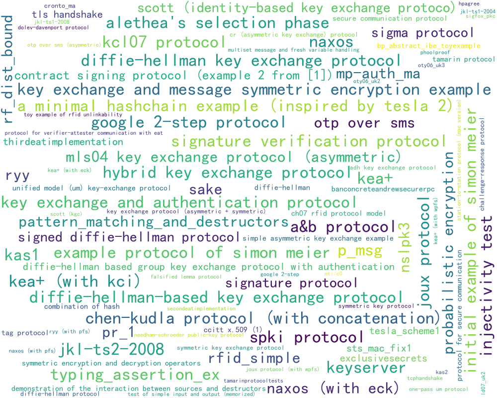
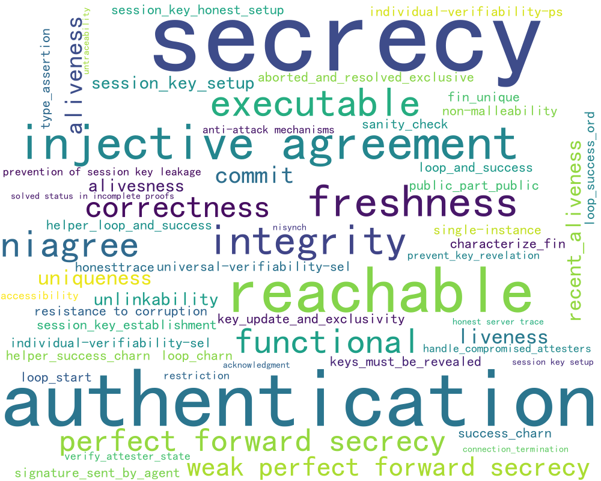
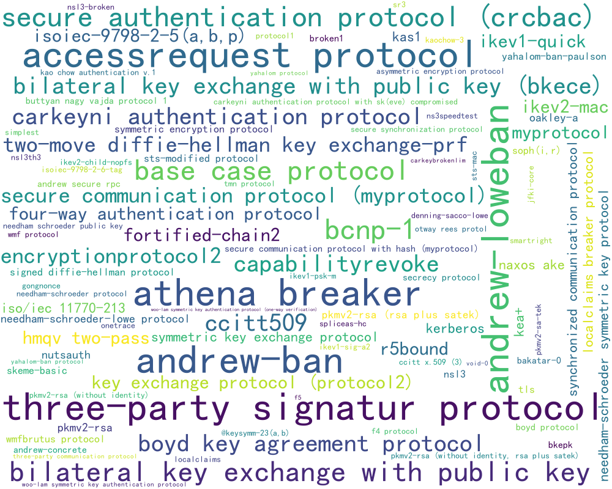
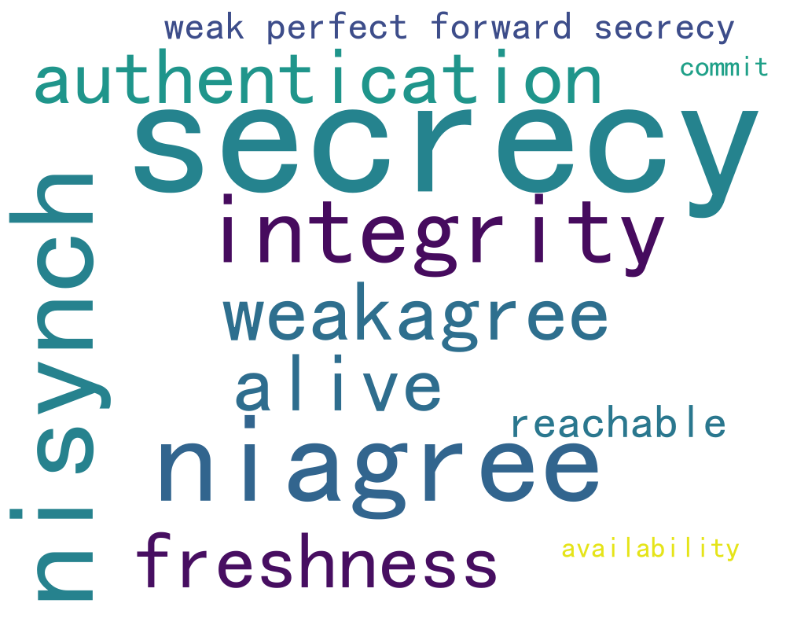
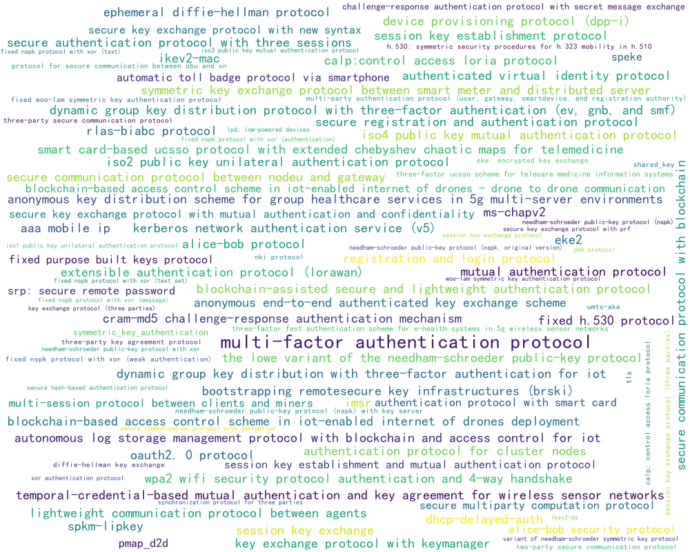
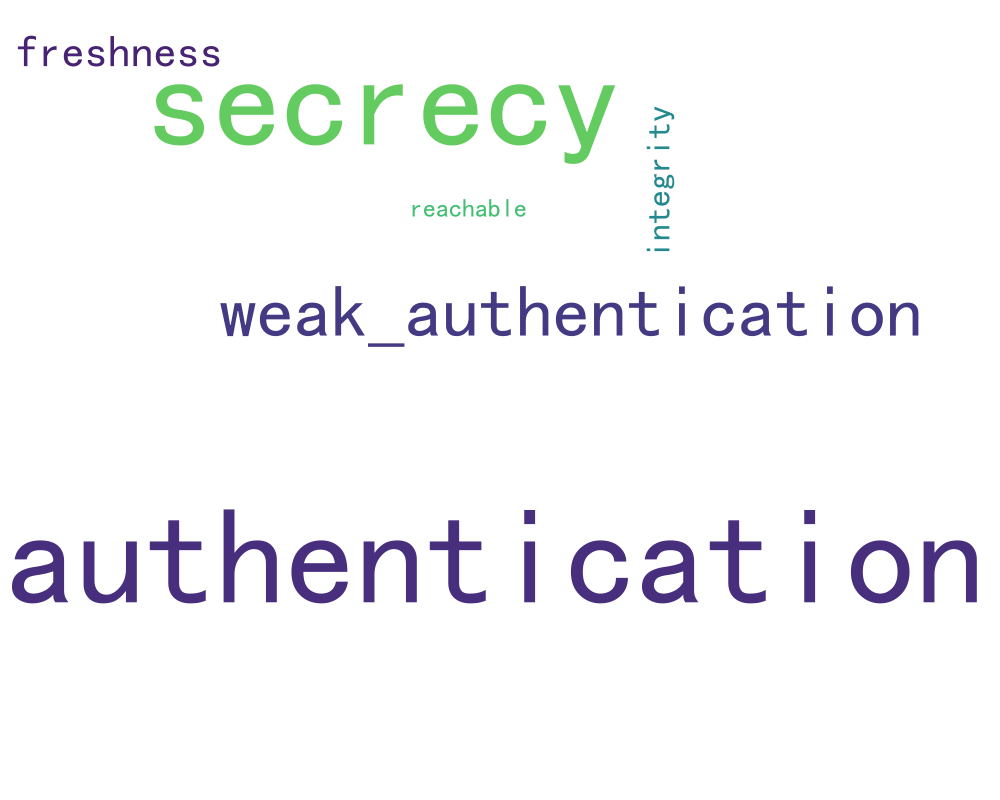
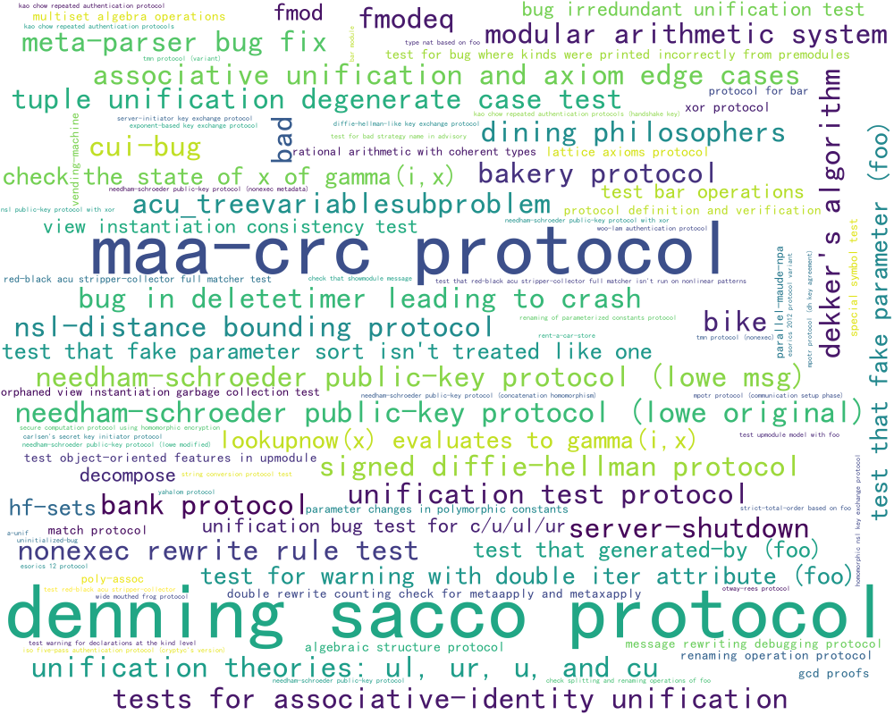
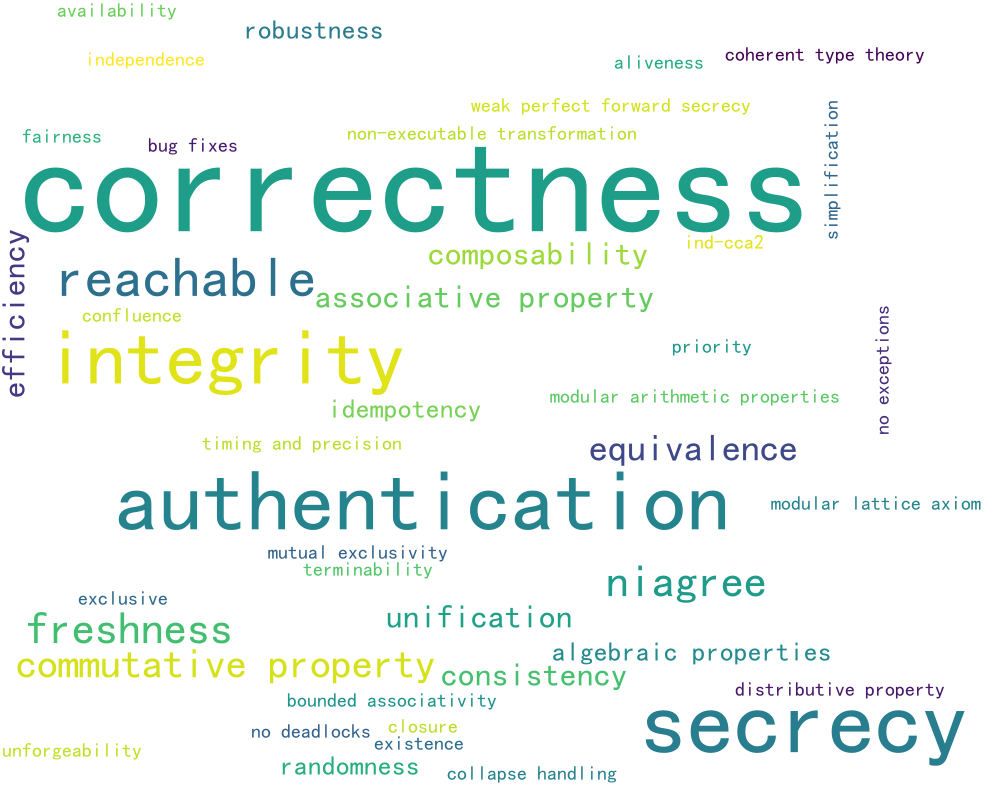

<h1 align="center">🗂️ CrypFormAgent Evaluation Suite</h1>

<p align="center">
  <b>Datasets, Coverage Figures, Task Splits, and Property Taxonomy</b>
</p>

<p align="center">
  
  
  
  
  
</p>

> The dataset suite covers the full formalization workflow: interpreting existing formal code, generating new artifacts from logic descriptions, completing masked artifacts, correcting faulty artifacts, and transforming formal models across verifier languages.

---

## 🔗 Quick Navigation

| Area | Files |
| --- | --- |
| Task data | [`generation/`](generation/), [`completion/`](completion/), [`correction/`](correction/), [`interpretation/`](interpretation/), [`transformation/`](transformation/) |
| Global figures | `protocols.png`, `propeties.png`, `Security Property.png`, `Property Distribution.png` |
| Per-language coverage | `*_protocols.png`, `*_propeties.png` |
| Transformation details | [`transformation/README.md`](transformation/README.md) |

---

## 📌 Coverage Snapshot

| Dimension | Coverage |
| --- | ---: |
| Formal instances | 700 |
| Distinct schemes | 677 |
| Formal languages/tools | SPDL, SPTHY, PV, HLPSL, Maude, EC, CV |
| Deduplicated property labels | 160 |
| Task families | generation, completion, correction, interpretation, transformation |

The included schemes span authentication, key exchange, secure communication, zero-knowledge proof examples, computational proof artifacts, post-quantum settings, and tool-specific verification examples. The attacker models include Dolev-Yao network adversaries, state/ephemeral reveal settings, CK/eCK-style models, and application-specific assumptions when encoded by the source artifact.

---

## 🧭 Folder Layout

```text
datasets/
├─ generation/          logic-description -> formal artifact
├─ completion/          masked formal code -> completed artifact
├─ correction/          faulty artifact -> repaired artifact
├─ interpretation/      formal artifact -> notation/logic explanation
├─ transformation/      source formal language -> target formal language
├─ protocols.png
├─ propeties.png
├─ Security Property.png
├─ Property Distribution.png
└─ README.md
```

Some figure filenames preserve the original asset spelling, such as `propeties*.png`.

---

## 🌐 Global Views

| View | Figure |
| --- | --- |
| Protocol/scheme word cloud |  |
| Property word cloud |  |
| Security-property bar view |  |
| Property distribution |  |

---

## 🧩 Per-Language Snapshots

| Tool/language | Protocols | Properties |
| --- | --- | --- |
| ProVerif / PV |  |  |
| Tamarin / SPTHY |  |  |
| Scyther / SPDL |  |  |
| AVISPA / HLPSL |  |  |
| Maude-NPA / Maude |  |  |

---

## 🏷️ Property Taxonomy

The 160 property labels are normalized into broad families so that heterogeneous tools can be compared under one task-level metric. The category labels A-K are used only for analysis and reporting; they do not replace the original verifier claims or proof obligations stored in the task records.

| Category | Scope | Rationale |
| --- | --- | --- |
| A | Symbolic protocol goals such as secrecy, authentication, agreement, integrity, and liveness. | Captures protocol-level trace or correspondence properties. |
| B | Freshness, binding, session discipline, key lifecycle, and compromise handling. | Separates session-structure and key-lifecycle constraints from core goals. |
| C | Forward secrecy and compromise resilience. | Captures security under compromise over time. |
| D | Reachability, executability, trace sanity, and modeling restrictions. | Captures model feasibility and sanity checks rather than security goals. |
| E | Privacy, anonymity, unlinkability, deniability, repudiation, and related goals. | Groups privacy-family and accountability properties. |
| F | Computational notions and primitive-level properties such as IND-style security and unforgeability. | Captures game-based and primitive-level cryptographic notions. |
| G | Proof, game, probability, correctness, and meta-properties. | Captures proof-system machinery and meta-lemmas. |
| H | Algebraic, rewriting, and logic-structure properties. | Captures algebraic identities and rewriting/logic infrastructure. |
| I | Engineering, performance, reliability, and miscellaneous quality attributes. | Captures non-cryptographic quality attributes. |
| J | Tool/script workflow markers and helper lemmas. | Captures proof-script plumbing and project-specific helper checks. |
| K | Tool-level specification and query patterns. | Captures how properties are formulated in tool-specific queries. |

The exact normalized labels assigned to each family are:

| Category | Included labels |
| --- | --- |
| A | `secrecy`, `authentication`, `integrity`, `niagree`, `nisynch`, `injective agreement`, `weakagree`, `weak_authentication`, `alive`, `aliveness`, `alivesness`, `recent_aliveness`, `liveness`, `acknowledgment`, `connection_termination`, `commit` |
| B | `freshness`, `uniqueness`, `injectivity`, `session_key_setup`, `session key setup`, `session_key_honest_setup`, `session_key_establishment`, `prevention of session key leakage`, `keys_must_be_revealed`, `key_update_and_exclusivity`, `aborted_and_resolved_exclusive`, `mutual exclusivity`, `exclusive`, `prevent_key_revelation`, `verify_attester_state`, `handle_compromised_attesters` |
| C | `perfect forward secrecy`, `weak perfect forward secrecy`, `resistance to corruption` |
| D | `reachable`, `executable`, `honesttrace`, `honest server trace`, `restriction`, `sanity_check`, `single-instance`, `solved status in incomplete proofs` |
| E | `privacy`, `anonymity`, `unlinkability`, `untraceability`, `offline deniability`, `revocability`, `non-repudiation` |
| F | `ind-cpa`, `ind-cca2`, `indistinguishability`, `ind-ror`, `int-ctxt`, `kpa`, `one-way`, `collision resistance`, `unforgeability`, `suf-cma`, `randomness`, `rodomness`, `pseudorandomness`, `pseudo-random permutation`, `unpredictability`, `non-malleability`, `extractability`, `zero-knowledge`, `statistical hiding`, `perfect hiding`, `computational security`, `one-session secrecy`, `non-interactive` |
| G | `correctness`, `equivalence`, `equivariance`, `losslessness`, `uniformity`, `probability boundedness`, `probability split lemma`, `interval probability lemma`, `fundamental predicate lemma`, `absolute probability difference`, `measure-based properties`, `soundness`, `completeness`, `sufficiency`, `reflexive property`, `independence`, `consistency`, `robustness`, `simplification`, `well-foundedness`, `finiteness`, `forking invariance`, `jensen's inequality`, `finite support inequality`, `function restriction property`, `recursive relationships`, `fullness`, `positivity`, `non-negative`, `logarithm properties` |
| H | `commutative property`, `associative property`, `distributive property`, `distributive property `, `algebraic properties`, `modular arithmetic properties`, `modular lattice axiom`, `bounded associativity`, `idempotency`, `idempotent property`, `additive inverse property`, `surjectivity`, `unification`, `closure`, `existence`, `confluence`, `terminability`, `composability` |
| I | `efficiency`, `availability`, `accessibility`, `fault tolerance`, `timing and precision`, `priority`, `no deadlocks`, `no exceptions`, `exception security`, `bug fixes`, `compliance`, `usability`, `anti-attack mechanisms`, `functional` |
| J | `loop_start`, `loop_success_ord`, `loop_charn`, `helper_loop_and_success`, `loop_and_success`, `helper_success_charn`, `success_charn`, `type_assertion`, `public_part_public`, `signature_sent_by_agent`, `permutation_size`, `non-executable transformation`, `lemma_kok`, `characterize_fin`, `fin_unique` |
| K | `secure event notification`, `bidirectional check`, `event correspondence` |

---

## ⚖️ Balance and Metrics

The property distribution is intentionally not balanced. Secrecy and authentication account for a large fraction of the corpus because they dominate many public protocol formalizations and tool testbeds. We do not balance or resample these labels: the resulting distribution reflects the collected artifacts, while the long-tail labels document coverage across PFS variants, privacy goals, application-specific invariants, and computational/proof obligations.

The claim of 160 distinct properties therefore indicates coverage and extensibility rather than uniform statistical power for every label. The paper uses a single unified metric across tasks because the main comparison is across heterogeneous verifiers and formalization tasks, where tools expose different goal granularities and long-tail labels are too sparse for stable per-label model ranking. Component rates such as analyzability/executability and correctness are reported alongside unified scores to contextualize performance.

---

## 📁 Task Subfolders

| Task | Directory | Input -> output |
| --- | --- | --- |
| Generation | `generation/` | logic description -> formal artifact |
| Completion | `completion/` | masked formal code -> completed artifact |
| Correction | `correction/` | syntax/semantic fault -> repaired artifact |
| Interpretation | `interpretation/` | formal artifact -> notation/logic explanation |
| Transformation | `transformation/` | source formal language -> target formal language |
