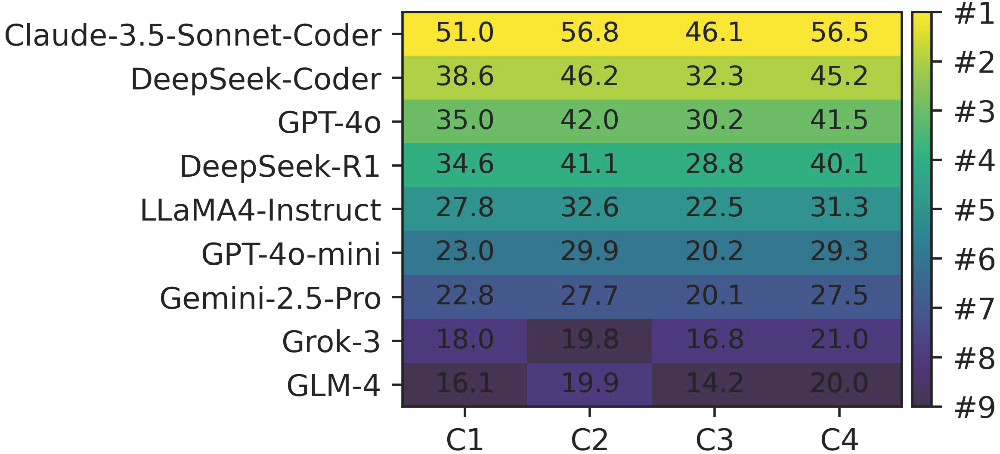

<h1 align="center">📊 Scoring and Robustness Checks</h1>

  <b>Metric Sensitivity, Interpretation-Similarity Validation, and Manual Audit Examples</b>

  
  
  
  

> This appendix records robustness checks for the scoring choices used in the CrypFormAgent evaluation. It focuses on rank stability under alternative weights and on whether embedding-based interpretation similarity agrees with human inspection.

---

## 🗺️ Quick Map

| Asset | Purpose |
| --- | --- |
| `rank_heatmap.png` | Overall ranks under alternative scoring configurations. |
| `*-label.txt` | Reference interpretation paired with the source formal artifact. |
| `*.txt` without `-label` | Model-side interpretation compared against the reference. |
| This README | Metric settings, robustness claims, and audit-case guide. |

---

## 🎛️ Sensitivity to Metric Parameters

We evaluate four alternative parameter settings. The configurations cover the default difficulty-aware task weights, uniform task weights, heavier weights on generation/transformation, and modified interpretation/correction sub-weights with a weaker analyzability penalty.

| Config | Generation | Completion | Transformation | Correction | Interpretation | Alpha | Beta | Error weight | False-result weight | Gamma |
| --- | ---: | ---: | ---: | ---: | ---: | ---: | ---: | ---: | ---: | ---: |
| C1 | 0.25 | 0.20 | 0.25 | 0.15 | 0.15 | 0.30 | 0.30 | 0.40 | 0.60 | 1.0 |
| C2 | 0.20 | 0.20 | 0.20 | 0.20 | 0.20 | 0.30 | 0.30 | 0.40 | 0.60 | 1.0 |
| C3 | 0.30 | 0.15 | 0.30 | 0.10 | 0.15 | 0.30 | 0.30 | 0.40 | 0.60 | 1.0 |
| C4 | 0.25 | 0.20 | 0.20 | 0.15 | 0.20 | 0.40 | 0.20 | 0.50 | 0.50 | 0.5 |

Model rankings remain stable across these settings. The top models remain unchanged, and only the two lowest-ranked models swap under uniform weights. The default configuration also has high rank correlation with the alternatives, with Spearman correlation at least 0.98 and Kendall correlation at least 0.94.

---

## 🔎 Interpretation Similarity Validation

The interpretation task uses embedding-based cosine similarity for logic descriptions and code annotations. We validate this metric in two ways:

- Recompute interpretation scores using alternative encoders, including BGE-large and E5-large-v2 in addition to the default Qwen3-Embedding-8B.
- Manually audit high- and low-similarity cases.

Across 1,260 interpretation instances, the encoders show strong agreement, with Pearson correlation at least 0.98 and Spearman correlation at least 0.88. For manual audit, we identify 711 high-similarity instances and 40 low-similarity instances, then inspect 20 cases from each group.

| Aspect | File | Model | Qwen3 | BGE | E5 | Human audit |
| --- | --- | --- | ---: | ---: | ---: | --- |
| Notation | `andrew-lowe-ban.spdl` | Claude-3.5 | 0.980 | 0.960 | 0.982 | Correct |
| Logic | `TLS-PSK.spthy` | GPT-4o | 0.960 | 0.940 | 0.950 | Correct |
| Logic | `IKEv2-DS.hlpsl` | GPT-4o | 0.960 | 0.970 | 0.960 | Correct |
| Notation | `IKEv2-DS.hlpsl` | GPT-4o | 0.980 | 0.970 | 0.970 | Correct |
| Notation | `nsl3.spdl` | LLaMA4 | 0.975 | 0.981 | 0.983 | Correct |
| Logic | `woo-lam.spdl` | LLaMA4 | 0.020 | 0.022 | 0.019 | Incorrect |
| Notation | `OtwayRees.pv` | LLaMA4 | 0.120 | 0.180 | 0.150 | Misses secrecy |
| Logic | `Anonymous.hlpsl` | Grok-3 | 0.380 | 0.361 | 0.364 | Incorrect |
| Notation | `Anonymous.hlpsl` | Grok-3 | 0.010 | 0.020 | 0.010 | Misses code |
| Logic | `nsl3.spdl` | LLaMA4 | 0.019 | 0.027 | 0.022 | Incorrect |

---

## 🧾 Manual Audit Examples

The folder includes representative interpretation-similarity examples used for manual inspection. Files ending in `-label.txt` contain the reference interpretation paired with the source formal artifact; the corresponding file without the suffix contains the model-side interpretation being compared.

| Case | Compared files | What it illustrates |
| --- | --- | --- |
| Needham-Schroeder-Lowe | `nsl3-label.txt`, `nsl3.txt` | High-similarity SPDL example with preserved roles, nonces, claims, and message flow. |
| Woo-Lam | `woo-lam-label.txt`, `woo-lam.txt` | Low-similarity SPDL example where the output drifts toward code-edit instructions. |
| IKEv2-DS | `IKEv2-DS-label.txt`, `IKEv2-DS.txt` | HLPSL example for checking whether a long interpretation preserves authentication and key-exchange structure. |
| Anonymous E2E AKE | `Anonymous_E2E_authenticated_key_exchange_scheme-label.txt`, `Anonymous_E2E_authenticated_key_exchange_scheme.txt` | HLPSL example showing how verbose reasoning can still omit or distort security goals. |

High-similarity outputs generally preserve scheme roles, message flows, and security goals. Low-similarity outputs often miss or mis-specify key semantics, such as secrecy goals, nonce bindings, or adversary assumptions. This motivates the multi-signal interpretation score that combines logic similarity, annotation similarity, and verifier compatibility.
